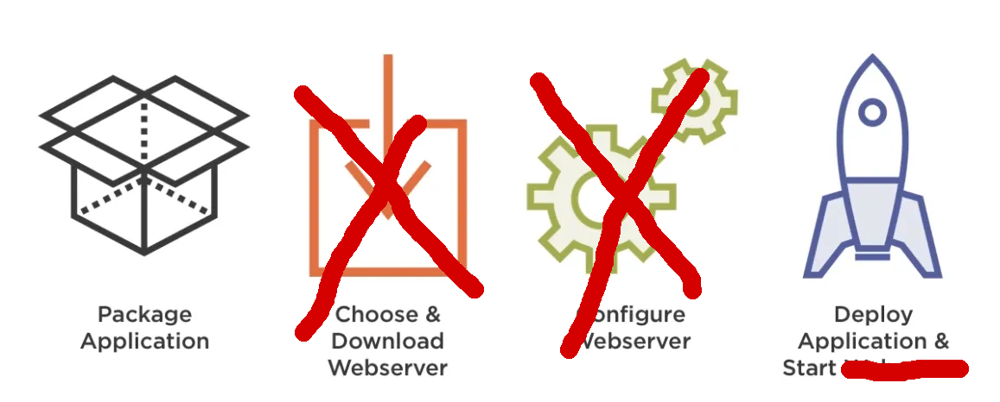

# Spring Boot workshop

17.10.2019

Khôi Tran tran@puzzle.ch

---

## First things first

Rocket.chat:

https://chat.puzzle.ch/channel/spring-workshop

Presentation materials:

https://puzzle.github.io/spring-workshop [[github]](https://github.com/puzzle/spring-workshop)

---

## Goals

Getting to know some tools of the Spring (Boot) ecosystem to make your life (hopefully) easier.

---

## Agenda morning

* Introduction to Spring Boot and Spring Core
* Basic Spring exercises
* Deploy on OSE using fabric8
* Deploy a Spring Boot Admin pod

---

## Agenda afternoon

* Testing
* AOP
* Cache abstraction
* WebFlux / WebClient

* Free time to experiment and explore

---

## Quick Introduction to Spring


---

## What is Spring Boot?

Spring applications were a mess of XML files meshed together.

Spring Boot facilitates setup, configuration of spring applications.

---

## Classic Java web development


---

## Spring Boot development



---

## Alternatives

* Eclipse Microprofile
* Quarkus.io
* Grails (built on Spring)

---

## How does Spring Boot do that?

* *Component scanning*
* *Standalone fat jar/war* (embedded tomcat/netty/undertow in jar)
* *Opinionated* (defaults, fallbacks)
* *starter packages* (i.e. spring-starter-web)

---

## Minimal Spring Boot application

```java
@SpringBootApplication
@RestController
public class MinimalApplication {
	public static void main(String[] args) {
        SpringApplication.run(MinimalApplication.class, args);
	}
  @GetMapping
  public String index() {
    return "Hello World";
  }
}
```

---

## Spring Boot Component Scan

* Default: Scans the package + subpackages of `@SpringBootApplication`
* Annotations: `@Component`, `@Configuration`, `@Controller`, `@RestController`, `@Service`, `@Repository`

---

## Spring Boot Component Scan (2)

This means that most spring related things don't matter in which file they are configured, as long as the class is properly annotated.

```java
// HelloWorldController.java
@RestController
public class HelloWorldController {
  @GetMapping
  public String printHelloWorld() {
    return "Hello World";
  }
}
```

Read more: [1](https://docs.spring.io/spring-boot/docs/current/reference/html/using-boot-using-springbootapplication-annotation.html) [2](https://www.baeldung.com/spring-component-scanning)

---

## Dependency injection

Dependency Injection is handled by Spring DI.
It can inject objects annotated with `@Bean` and Spring `@Component` and alike.

---

## DI example

Field based injection

```java
// HelloWorldService.java
@Service
public class HelloWorldService {
  public String getMessage() {
    return "Hello World";
  }
}
```

```java
// HelloWorldController.java
@RestController
public class HelloWorldController {
  @Autowired
  private HelloWorldService helloWorldService;

  @GetMapping
  public String printHelloWorld() {
    return helloWorldService.getMessage();
  }
}
```

---

## DI example

Constructor based injection

```java
// HelloWorldController.java
@RestController
public class HelloWorldController {

  private HelloWorldService helloWorldService;

  // No need for any annotations
  public HelloWorldController(HelloWorldService helloWorldService) {
    this.helloWorldService = helloWorldService;
  }
  // ...
}
```

Read more: [[1]](https://docs.spring.io/spring-boot/docs/current/reference/html/using-boot-spring-beans-and-dependency-injection.html) [2](https://www.baeldung.com/spring-dependency-injection)

---

## DI conflict resolution

```java
@Service
@Primary
public class BeerService implements DrinkService {
  // ...
}
```

```java
@Service
@Qualifier("stayAwakeService")
public class CoffeeService implements DrinkService {
  // ...
}
```

---

## DI conflict resolution (2)

```java
@Controller
public class DrinkController {
  @Autowired
  @Qualifier("stayAwakeService")
  DrinkService myService; // CoffeeService - by @Qualifier anootation

  @Autowired
  DrinkService beerService; // BeerService - by field name

  @Autowired
  DrinkService service; // BeerService - by @Primary annotation

  public Iterable<Drink> getAllDrinks() {
    return repository.findAll();
  }
}
```

---

## Externalized configuration

* Environment variables
* application-&lt;PROFILE&gt;.yml
* application.yml

Read more: [1](https://docs.spring.io/spring-boot/docs/current/reference/html/boot-features-external-config.html)

---

## Retrieve Configuration

```java
@Value("${brewery.name}")
private String breweryName;

// with default value
@Value("${brewery.defaultBeer:Puzzle Spezialbräu}")
private String defaultBeer;
```

```yaml
// application.yml
brewery:
  name: Trappistes de Puzzle
  defaultBeer: Puzzle Malz Spezial
```

---

## Configuration property classes

```java
@Component
@ConfigurationProperties(prefix = "brewery")
@Data
public class BreweryProperties {
  private boolean brewsCoffeeToo;
  private String defaultBeer;
  private String name;
}
```

```java
@Service
public class BreweryService {
  @Autowired
  BreweryProperties breweryProperties;

  public String getBreweryName() {
    return breweryProperties.getName();
  }
}
```

---

## Spring Profiles

* env var `SPRING_PROFILES_ACTIVE=dev` (comma delimited)
* `java -Dspring.profile.active=dev`
* IntelliJ launch configuration
* Programmatically: `SpringApplication.setAdditionalProfiles(...)`

---

## Spring Profiles

`application-dev.yml`
```yaml
spring.profiles.include:
  # include application-localdb.yml
  - localdb
  # include application-nosecurity.yml
  - nosecurity
```

---

## Spring Beans by Profile

```java
@Configuration
public class WebClientConfiguration {
  @Value("${webclient.password}")
  String password;

  @Profile("local")
  @Bean
  public WebClient webClientWithoutAuth() {
    return WebClient.builder()
      .build();
  }

  @Profile("!local")
  @Bean
  public WebClient webClientWithAuth() {
    return WebClient.builder()
      .defaultHeaders(headers -> headers.setBasicAuth("user", password))
      .build();
  }
}
```

Read more: [1](https://docs.spring.io/spring-boot/docs/current/reference/html/boot-features-profiles.html) [2](https://www.baeldung.com/spring-profiles)

---

# Hands-On Spring Boot project

* Checkout Beerio Example Project
* Login & create an openshift project
* Use fabric8 to deploy to openshift

---

## Prerequisites

* Java 11: with SDKMAN `sdk install java 11.0.3.hs-adpt`
* [openshift client](http://docs.appuio.ch/en/latest/getting-started.html#cli)

---

## Checkout beerio application

* `git clone git@github.com:puzzle/beerio.git` / `git clone https://github.com/puzzle/beerio.git`
* `mvn spring-boot:run` Start your application
* Check http://localhost:8080 if it runs!

---

## Login & create an openshift project

* `oc login https://techlab.openshift.ch`
* `oc new-project sbw-2019-$(whoami)`

---

## Fork & checkout & deploy

* `git clone https://github.com/puzzle/beerio`
* Edit `fabric8.namespace` in `pom.xml` to your openshift project
* `mvn fabric8:deploy`

---

# Exercise time!

* CRUDs
* Custom Queries

---

## Exercise 1 - some CRUD operations

1. Add a REST endpoint to add beers!
2. Test it using swagger ui

In `BeerController`:

```java
@PostMapping
public void addBeer(@RequestBody Beer beer) {
  // ...
}

```

---

## Exercise 2 - some CRUD operations (2)

1. Add a REST endpoint to delete a beer by ID.
2. Test it using swagger ui

---


## Exercise 3 - leverage JPA repository magic

Add a REST endpoint which returns the top 10 beers with highest abv (alcohol by volume)

Hint: [Method name keywords](https://docs.spring.io/spring-data/jpa/docs/current/reference/html/#jpa.query-methods.query-creation)

Hint: [Limiting results](https://docs.spring.io/spring-data/jpa/docs/current/reference/html/#repositories.limit-query-result)

---

## Exercise 3 - DI format JSON

Spring uses Jackson `ObjectMapper` to serialize JSON.

1. Use `@Bean` to overwrite the ObjectMapper that pretty prints JSON.

---

## Exercise 4.1 - run Spring Boot Admin locally

1. Checkout https://github.com/puzzle/beerio-admin / `git@github.com:puzzle/beerio-admin.git`
2. Edit `fabric8.namespace` in `pom.xml`
3. Run `SpringBootAdminApplication` locally
4. Check http://localhost:8081 if Spring Boot Admin runs

---

## Exercise 4.2 - connect Beerio App to SB Admin

1. Add [Spring Boot Admin Client dependencies](https://codecentric.github.io/spring-boot-admin/2.1.6/#register-clients-via-spring-boot-admin) to the Beerio App.
2. Add configuration property `spring.boot.admin.client.url: http://localhost:8081`
3. Check if the application properly registers itself in Spring Boot Admin!

---

## Exercise 4.3 - Spring Boot Admin on openshift

1. Use `mvn fabric8:deploy` to deploy spring-boot-admin to openshift
2. Configure Beerio App to connect to spring-boot-admin
3. Use Spring Profiles to distinguish between local and other environments!

Hints: 

`spring.boot.admin.client.url: http://beerio-admin:8081`

`spring.boot.admin.client.instance.prefer-ip: true`

---

# Lunchtime


---

# Spring Testing

Why? Spring brings it's own testing framework.


---

## Things to know

* Spring Tests is based on [Mockito](https://site.mockito.org/)
* `@Autowire` will inject `@MockBean` and `@SpyBean` instead of their "real" counterparts.

---

## Minimal setup

```java
@RunWith(SpringRunner.class)
@SpringBootTest
public class MyTests {
  @Test
  public void contextLoads() {
  }
}
```

Caveats: Will initialize the whole Spring Boot application (and it will take a long time).

--> It is recommended that you only load and test parts of your application.

---

## Class context

```java
@RunWith(SpringRunner.class)
@SpringBootTest(classes = {BeerService.class})
public class BeerioTests {

  @Autowired
  BeerService beerService;

  @MockBean
  BeerRepository beerRepository;

  @Test
  public void beerServiceTest() {
  // Mock dependencies
  when(beerRepository.findAll())
    .thenReturn(singleton(Beer.builder().name("Bärner Müntschi").build()));

  // Asserts
  assertThat(beerService.findAll())
    .hasSize(1)
    .extracting(Beer::getName)
    .containsExactly("Bärner Müntschi");

    verify(beerRepository, times(1)).findAll();
  }
}
```

The smaller your context, the better!

---

## Custom testing properties

```java
@RunWith(SpringRunner.class)
@SpringBootTest(classes = {BeerService.class},
  properties = "brewery.name=Verein Roggemoser")
public class BeerioTests {
  // ...
}
```

---

## Further Spring Testing resources

* [MockMvc](https://spring.io/guides/gs/testing-web/)
* [Spring Testing](https://docs.spring.io/spring/docs/current/spring-framework-reference/testing.html)
* [Spring Testing Tutorial](https://www.baeldung.com/spring-boot-testing)

---

# Spring AOP

Why?

Further separation of business and other(?) code.

> With great power comes great responsiblity. - Uncle Ben

---

## Things to know

Spring supports AOP without [AspectJ weaving](https://www.baeldung.com/aspectj)... BUT only on Spring managed `@Beans`.

## How does Spring do it?

Access to Beans are being proxied by Spring.

---

## When to use AOP

* Monitoring
* Profiling
* Auditing
* Security
* ...

---

## All AspectJ PointCuts are supported

### Executions

```java
@Aspect
@Component
public class ExampleAspects {
  @Before("execution(* ch.puzzle..*.*(..))")
  void onBefore(JointPoint jp) {
  }

  @After("execution(* ch.puzzle..*.*(..))")
  void onAfter(JointPoint jp) {
  }

}
```

---

```java
@Aspect
@Component
@Slf4j
public class ExampleAspects2 {
  @Around("execution(* ch.puzzle..*.*(..))")
  void around(ProceedingJointPoint jp) {
    return jp.proceed();
  }

  @AfterThrowing(pointcut = "execution(public * ch.puzzle..*.*(..))", throwing = "e")
  void onException(Exception e) {
    // Additional error handling
  }
}
```

---

### Annotations

```java
@Aspect
@Component
@Slf4j
public class ExampleAspects2 {
  @Around("@annotation(org.springframework.web.bind.annotation.GetMapping)")
  Object getOperations(ProceedingJoinPoint joinPoint) throws Throwable {
    log.trace("Before");
    Object result = joinPoint.proceed();
    log.trace("After");
    return result;
  }
}
```

Read more: [1](https://docs.spring.io/spring/docs/5.1.x/spring-framework-reference/core.html#aop) [2](https://www.baeldung.com/spring-aop)

---

## AOP exercise

Use `@Around` to measure time used in `CountryController::findAllCountries()`

Hint: `System.currentMillis()` to take time or Springs `org.springframework.util.StopWatch` to measure time.

---

# Spring Cache Abstraction

> Sometimes performance does matter.

---

## How does Spring Cache work?

1. Add to an `@Configuration` class the `@EnableCaching` annotation
2. (optional) configure a more sophisticated caching library (Caffeine, EhCache, ...)
3. Annotate method to be cached with `@Cacheable("myCacheName")`
4. Done!

Read more: [1](https://docs.spring.io/spring/docs/5.1.x/spring-framework-reference/integration.html#cache) [2](https://www.baeldung.com/spring-cache-tutorial)

---

## Cache exercise

Use `@Cacheable` on `CountryService::findAllCountries()`.
See improved performance thanks to your AOP logging!

---

## Bonus exercise

Try to use Spring Cache with Caffeine or EhCache as caching backend.

---

# Reactive programming: Spring WebFlux & WebClient

Reactive programming in Spring.

[The introduction to Reactive Programming](https://gist.github.com/staltz/868e7e9bc2a7b8c1f754)

Similar to:

* RxJs from angular
* RxJava
* Rx.Net

---

## What is reactive programming?

> Reactive programming is programming with asynchronous data streams.

> Reactive programming libraries give you a toolbox to work with those streams.

---

## Traditional vs reactive


---

## Traditional vs reactive (2)


---

## Comparison

Reactive has

* fewer threads for same performance
* if you get your head around Rx, then code can be more concise

---

## WebFlux exercise

Make a server sent event stream with this signature:

```java
@GetMapping(value = "beers", produces = MediaType.TEXT_EVENT_STREAM_VALUE)
@ApiOperation("beers")
public Flux<ServerSentEvent<Beer>> beerAnnouncer() {
  // Send all 3 seconds a beer in NON-BLOCKING manner (don't use Thread.sleep)
}
```

---

## Hints

1. Use Flux.interval() to create a interval stream
2. Use Flux.fromIterable() to create a beer stream
3. Use Flux.zip() to combine

---

# Thank you & Feedback?


